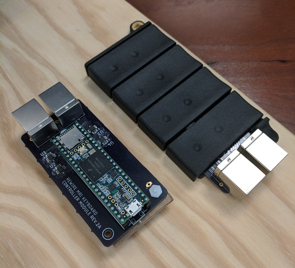
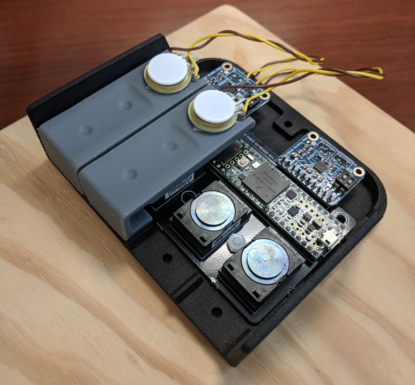

# rewire-keyboard

This is a work-in-progress repository for the force sensitive keyboards used by the [Rewire Lab](http://rewire.me.utexas.edu/). It currently includes software and firmware interfaces, and will eventually include hardware designs (circuit boards and mechanical parts).

## Keyboard types

Each keyboard incorporates 4 force-sensitive buttons and can be used left- or right-handed. There are currently 2 major keyboard types: (1) MRI compatible and (2) non-MRI compatible with vibrotactile stimulators.

### MRI compatible (`mriKeyboard`)

This keyboard consists of 2 components: the keyboard module and the controller module. Standard RJ45 cables are used to transmit force recordings from the keyboard (inside the scanner) to the controller (inside the control room).

Depending on the positioning of the force sensors within/near the scanner, significant high frequency noise can be introduced by the scanner. In these cases, the signals should be passed through RF filters in the scanner room wall.

### non-MRI compatible with vibrotactile stimulators (`vibeKeyboard`)

This keyboard has all components on the same board. It also has a separate 5V power connector and audio amplifiers for the vibrotactile stimulators. 

If vibrotactile stimulation is not required, then a simpler configuration can be used (`forceKeyboard`). This version does not require external 5V power or installation of audio amplifiers to the main circuit board.

## Interface

A [Teensy USB controller](https://www.pjrc.com/teensy/) is used to record forces and transmit them to a display computer as a [USB HID joystick](https://www.pjrc.com/teensy/td_joystick.html), which is Windows/OSX/Linux compatible.

Sample display/game scripts are contained in the `./display` subfolder. These examples are written in Python using Pygame, which has an easy-to-use joystick/controller interface. Force inputs can also easily be captured in game engines such as Unity.

To output vibrotactile stimuli, a raw serial interface is used. Stimulus files are stored on a microSD card on the Teensy. Example stimulus files, as well as a Python script to generate them, can be found in `./firmware/vibeKeyboard/stims`. These are stereo `.WAV` files used to deliver 250Hz/20ms duration stimuli to two fingers in quick succession in a [tactile temporal order judgment task](http://www.scholarpedia.org/article/Tactile_temporal_order). Sample output to the Teensy from Python can be found in the `./display/keyboardClass.py` class.

## Firmware

Arduino code for each keyboard version is located in the `./firmware` folder. The Teensy has a 13 bit ADC, whereas the output for a USB joystick axis is limited to 10 bits. If higher resolution is desired, the firmware can be configured to output a limited range of forces at higher resolution using the `MAX_FORCE_OUT` variable. 

Vibrotactile stimuli are addressed using a string of characters corresponding to a specific `.WAV` file. The current `vibeKeyboard` firmware is only compatible with the existing stimulus set for a temporal order judgment task, but can be customized for arbitrary stimuli.

## Hardware

Hardware is under development and final designs are not yet available.

### Circuit boards

Prototype boards have been designed in EAGLE and built by [Oshpark](https://oshpark.com/). Final designs and drawings will eventually be posted.

### Other parts

In progress mechanical parts can be found on [OnShape](https://cad.onshape.com/documents/ac102712f8d1c43274e5ca9a/w/98e7a679d8a4a7765bb5abd0/e/b2401a3df767a35630ee1038). Final designs and drawings will eventually be posted.
